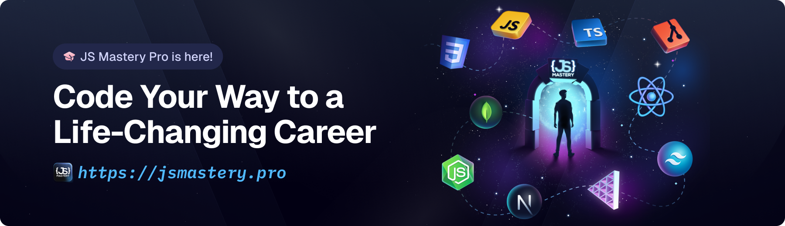

<div align="center">
  <h1>Miguel Ángel Cruz Reyes</h1>
  <h2>Portafolio Profesional</h2>
  
  <div>
    
    
    
    
    
  </div>
</div>

## 👨‍💻 Sobre Mí

¡Hola! Soy Miguel Ángel Cruz Reyes, estudiante de Ingeniería en Ciencias de la Computación en la BUAP con una gran pasión por la programación, la enseñanza y la tecnología. Este portafolio muestra mis proyectos, habilidades y experiencia en el desarrollo de software.

## 🚀 Proyectos Destacados

- **Vetopolis** - Plataforma web para encontrar y agendar citas con veterinarios
- **Expense Tracker** - Aplicación de finanzas personales con soporte multi-moneda
- **Track My Bus** - Aplicación móvil para seguimiento de rutas de autobuses universitarios
- **Star-Delta Circuit Calculator** - Herramienta web para cálculos de circuitos eléctricos

## 💻 Habilidades Técnicas

- **Lenguajes**: JavaScript, TypeScript, Python, Java, C++
- **Frontend**: React, Next.js, Tailwind CSS, Three.js
- **Backend**: Node.js, Express, FastAPI, Django
- **Bases de Datos**: SQL, Supabase, Firebase
- **DevOps**: Docker, CI/CD, GitHub Actions

## 📚 Educación

- **Ingeniería en Ciencias de la Computación**
  Benemérita Universidad Autónoma de Puebla (BUAP)
  - Promedio: 3.9/4.0
  - Fecha de graduación esperada: Diciembre 2025

## 🏆 Logros

- 4° lugar en la categoría de aplicaciones de software avanzado en FEPRO 2024
- 7° lugar en el Hackathon de Talent Land 2025 (pista Capital One)
- Clasificación a la Competencia Nacional de Robótica FIRST Tech Challenge

## 🌐 Contacto

- 📧 Email: cruzmiguelangel858@gmail.com
- 💼 LinkedIn: [linkedin.com/in/miguelcr4](https://linkedin.com/in/miguelcr4)
- 💻 GitHub: [github.com/nova-cz](https://github.com/nova-cz)

---

<div align="center">
  <p>Hecho con ❤️ por Miguel Ángel Cruz Reyes</p>
  <p>Última actualización: Octubre 2025</p>
</div>

## ⚠️ Tutorial

This repository contains the code corresponding to an in-depth tutorial available on our YouTube channel, <a href="https://www.youtube.com/@javascriptmastery/videos" target="_blank"><b>JavaScript Mastery</b></a>.

If you prefer visual learning, this is the perfect resource for you. Follow our tutorial to learn how to build projects like these step-by-step in a beginner-friendly manner!

<a href="https://www.youtube.com/watch?v=E-fdPfRxkzQ" target="_blank"></a>

## <a name="introduction">🤖 Introduction</a>

The 3D Portfolio project is a highly engaging personal website that features animated 3D scenes, smooth camera transitions, interactive model showcases, and responsive design. It’s ideal for developers, designers, or freelancers looking to stand out in the digital crowd.

If you're getting started and need assistance or face any bugs, join our active Discord community with over **50k+** members. It's a place where people help each other out.

<a href="https://discord.com/invite/n6EdbFJ" target="_blank"></a>

## <a name="tech-stack">⚙️ Tech Stack</a>

- Three.js
- React Three Fiber
- Drei
- GSAP
- Tailwind CSS
- Vite
- React 19

## <a name="features">🔋 Features</a>

### Features of the 3D Portfolio Project

👉 Animated 3D models and reveal animations

👉 Realistic lighting and shadows

👉 GSAP-powered scroll interactions

👉 Responsive design with Tailwind CSS and Flexbox/Grid

👉 Micro Interactions

👉 Multi-section layout (About, Projects, Contact)

👉 Mobile optimized 3D experience

and many more, including code architecture and reusability.

## <a name="quick-start">🤸 Quick Start</a>

Follow these steps to set up the project locally on your machine.

**Prerequisites**

Make sure you have the following installed on your machine:

- [Git](https://git-scm.com/)
- [Node.js](https://nodejs.org/en)
- [npm](https://www.npmjs.com/) (Node Package Manager)

**Cloning the Repository**

```bash
git clone https://github.com/adrianhajdin/3d-portfolio.git
cd 3d-portfolio
```

**Installation**

Install the project dependencies using npm:

```bash
npm install
```

**Set Up Environment Variables**

Create a new file named `.env` in the root of your project and add the following content:

```env
VITE_APP_EMAILJS_SERVICE_ID=
VITE_APP_EMAILJS_TEMPLATE_ID=
VITE_APP_EMAILJS_PUBLIC_KEY=
```

Replace the placeholder values with your actual **[EmailJS](https://www.emailjs.com/)** credentials.

**Running the Project**

```bash
npm run dev
```

Open [http://localhost:5173](http://localhost:5173/) in your browser to view the project.


## <a name="links">🔗 Assets and Snippets</a>

Assets and snippets used in the project can be found in the **[video kit](https://jsm.dev/pfolio25-kit)**.

<a href="https://jsm.dev/pfolio25-kit" target="_blank">
  
</a>


## <a name="more">🚀 More</a>

**Advance your skills with JSM Pro Courses**

Enjoyed creating this project? Dive deeper into our PRO courses for a richer learning adventure. They're packed with
detailed explanations, cool features, and exercises to boost your skills. Give it a go!

<a href="https://beta.jsmastery.pro/" target="_blank">
  
</a>
